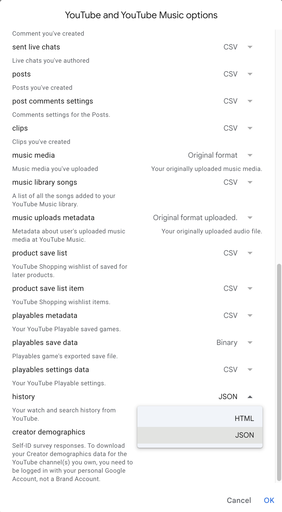
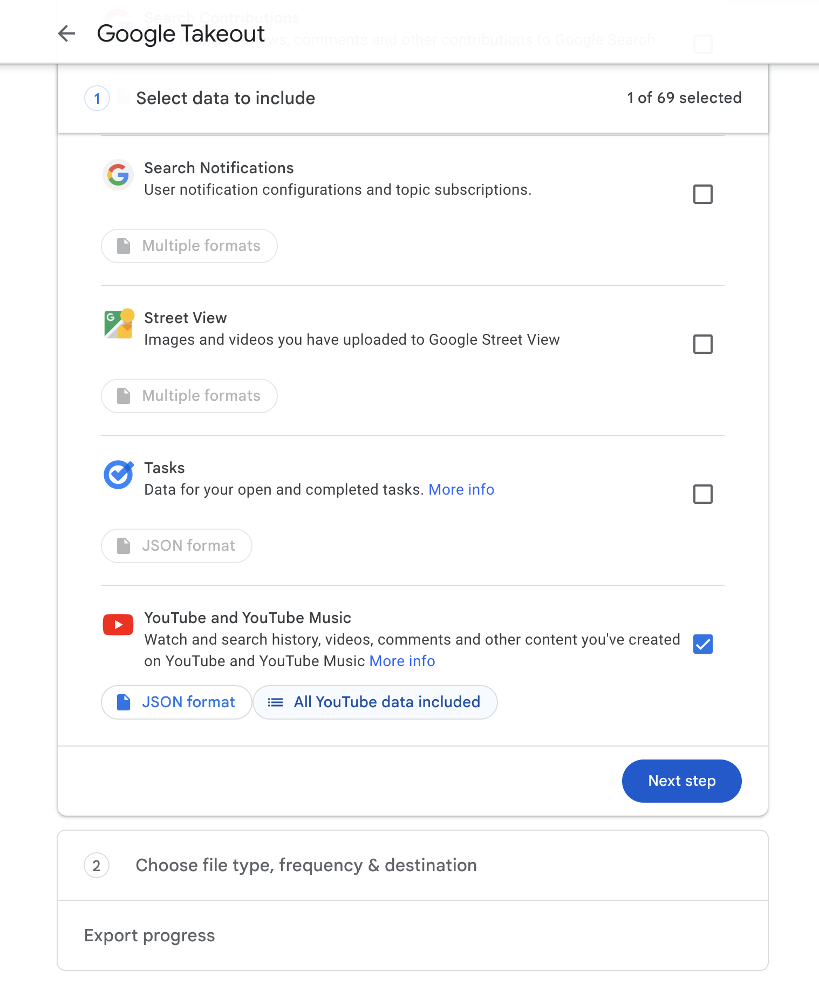

# TimeTube

### Description
Extracts a list of interests based on your YouTube history.

It takes your YouTube history of watched videos as input and returns a CSV file with weighted interests 
that can be used for visualizations or further analysis.


Note: visualization was not part of the project, I used [Flourish Studio](https://app.flourish.studio/) to 
generate a free preview. 

### Prerequisites
You need to download your history and get two API keys. One is YouTube API key to get some extra metadata and 
the other is OpenAI API key to help with categorization.

### Setup
1. Start by cloning the repository and entering the project directory
2. Install python 3 if you don't have it already
3. Setup python virtual environment `python -m venv venv`
4. Activate the virtual environment `source ./venv/bin/activate`
5. Install python packages `pip install -r requirements.txt`
6. When downloading your YouTube History from Google Takeout, deselect all other services and set the history format to JSON.
<p>
 
 
</p>

8. Unpack the downloaded content, and find `watch-history.json` in `YouTube and YouTube Music/history/`
and move it to the project root directory
9. Generate YouTube and OpenAI API keys and paste them into `.env` file in the root of the project
```
YOUTUBE_API_KEY=***
OPENAI_API_KEY=***
```
9. Run the program `python .`
